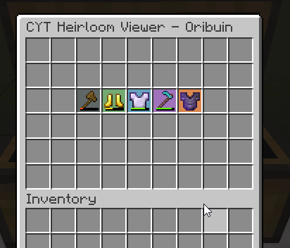
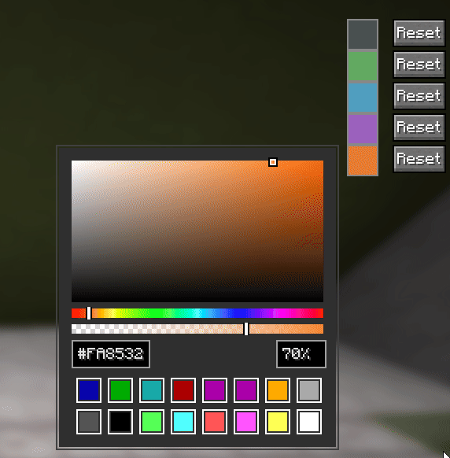

# CYT Heirloom Viewer
This is a simple fabric mod for 26.1+ that will highlight heirlooms in a chest inventory makling it easier to pick them out of the crowd of armour/weapons if you are running a mob farm

## How does it work?
When a menu is opened, it will scan each item and detect the variety of the item and assign it a colour based on the rarity. Currently, there are only 5 rarities available on the server and you can use the config to change the colour and opacity of each rarity
- Common (#4e5657)
- Uncommon (#69b869)
- Rare (#54abd1)
- Epic (#a767cf)
- Legendary (#fa8532)

## Mod Preview
| Heirloom Viewer                                    | Colour Selector                                    |
|----------------------------------------------------|----------------------------------------------------|
|  |  |
